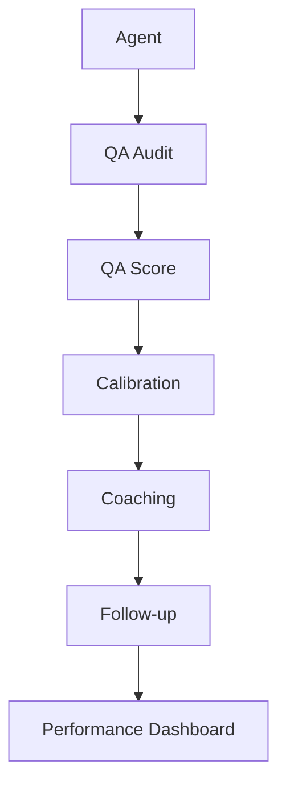
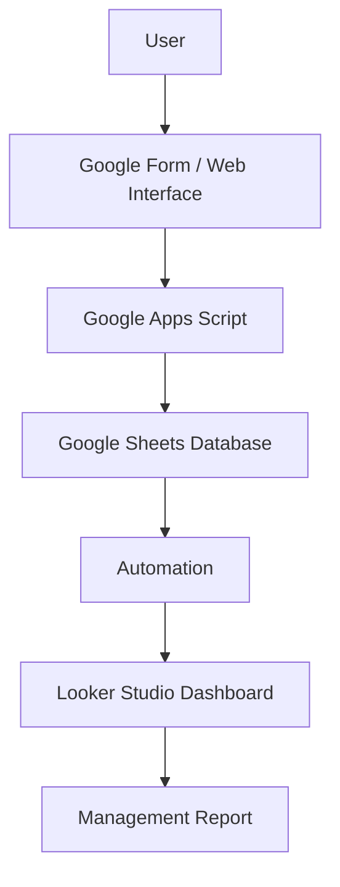

# Hi, I'm Joer Torrero 👋

### Business Systems & Automation Specialist | Google Sheets & Apps Script Expert | QA/BPO Systems Specialist

**Simple. Practical. Business-focused. Built around Google Workspace.**

I build practical systems that help businesses simplify operations, manage data, monitor performance, and automate repetitive workflows — using **Google Sheets + Apps Script + Business Process Automation**.

📍 Based in the Philippines · Working with small business owners, BPOs, and operations teams
🌐 Bilingual — Filipino & English

---

## About Me

I specialize in building practical business systems using Google Workspace. I have experience supporting Operations, Quality Assurance, BPO workflows, performance management, reporting, and data management.

I build practical business systems that turn manual processes, scattered data, and repetitive reporting into organized workflows.

I don't just write code — I build systems that help businesses organize data, simplify workflows, automate repetitive tasks, monitor performance, and make better operational decisions.

I'm not primarily a traditional software engineer. My strength is solving real business and process problems with usable systems, dashboards, automation, and tracking tools.

---

## 🎯 QA & BPO Systems

**This is one of my strongest professional areas.**

I design and build systems for Quality Assurance and Operations teams across BPO, customer service, contact center, shared services, and QA environments:

| System | What it handles |
|---|---|
| **QA Auditing System** | Audits, evaluations, QA scores, agent records, audit results, reporting |
| **QA Calibration System** | Calibration sessions, evaluator alignment, scoring comparison, action tracking, calibration results |
| **Audit the Auditor (ATA)** | Auditor monitoring, audit accuracy, auditor performance, findings, corrective actions |
| **QA Performance Dashboard** | QA scores, agent performance, team performance, trends, KPI monitoring |
| **Coaching & Feedback System** | Coaching records, coaching plans, feedback, follow-ups, escalations, resolution tracking |

---

## 🧰 Google Workspace Systems

Google Sheets · Google Apps Script · Google Forms · Google Sites · Looker Studio · Gmail automation · Google Drive workflows

## 📊 Dashboards & Reporting

KPI dashboards · QA dashboards · Performance dashboards · Management dashboards · Operational reports · Automated reporting · Data visualization · Looker Studio reporting

## 🧾 Business Templates

Ready-made Google Sheets systems including a Lending Management System, Sales & Inventory System, CRM, booking/property systems, employee tracking systems, and other spreadsheet-based business tools.

---

## 🛠️ Skills

**Frontend:** HTML · CSS · JavaScript

**Google Workspace:** Google Sheets · Google Apps Script · Google Forms · Google Sites · Looker Studio · Google Workspace

**Data:** SQL · Spreadsheet data modeling · Data validation · Reporting · Dashboard development

**Other:** Git · GitHub · APIs · JSON · Workflow automation

**AI tools in my workflow:** ChatGPT · Claude · Gemini

---

## ⚙️ How I Build Systems

1. **Understand** — Understand the client's existing workflow and pain points.
2. **Design** — Map the process, data structure, users, and required outputs.
3. **Build** — Develop the solution using Google Sheets, Apps Script, Forms, dashboards, and other appropriate tools.
4. **Automate** — Reduce repetitive manual work through Apps Script and workflow automation.
5. **Test** — Validate calculations, workflows, permissions, and edge cases.
6. **Deploy** — Provide documentation, user instructions, and a practical implementation.
7. **Improve** — Iterate based on actual business usage.

---

## 💼 What I Can Build

- QA Auditing Systems
- QA Calibration Tools
- Audit the Auditor Systems
- QA Performance Dashboards
- KPI Dashboards
- Coaching & Feedback Systems
- Employee Tracking Systems
- CRM Systems
- Sales & Inventory Systems
- Lending Management Systems
- Reporting Automation
- Business Dashboards
- Google Sheets Systems
- Apps Script Automation
- Google Workspace Workflows
- Custom Business Tools

All of the above can be customized based on business requirements.

---

## 🤔 Why Google Sheets + Apps Script?

Familiar interface, low deployment complexity, easy collaboration, easy data management, Google Workspace integration, custom automation, access from anywhere, flexible reporting, and cost-effectiveness make this stack useful for many small and medium business workflows.

This doesn't mean it's always the best solution — the right technology depends on the business requirements.

---

## 📌 Portfolio

Project repositories are being built out and documented — check back soon, or see the roadmap below.

## 🗺️ Roadmap

| Phase | Focus |
|---|---|
| 1 | Profile README *(this document)* |
| 2 | QA system demos |
| 3 | Business system demos |
| 4 | Apps Script automation projects |
| 5 | Dashboard projects |
| 6 | Documentation and screenshots |
| 7 | Professional portfolio polish |

---

## 🚀 Let's Build Something Practical

I work with businesses, operations teams, QA teams, BPOs, freelancers, and professionals who need custom systems.

**Custom systems. Practical automation. Simpler workflows.**

**Let's Make it Easy for You!**

📫 Reach me at **jmsasolutions@gmail.com**
